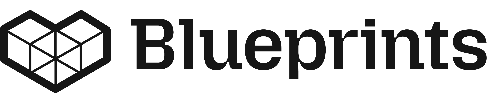

<p align="center">
  <picture>
    <!-- When the user prefers dark mode, show the white logo -->
    <source media="(prefers-color-scheme: dark)" srcset="./images/Blueprint-logo-white.png">
    <!-- When the user prefers light mode, show the black logo -->
    <source media="(prefers-color-scheme: light)" srcset="./images/Blueprint-logo-black.png">
    <!-- Fallback: default to the black logo -->
    
  </picture>
</p>
<p align="center">
  <picture>
    <!-- Fallback: default to the black logo -->
    
  </picture>
</p>
<div align="center">


[](LICENSE)
[](https://discord.gg/YuMNeuKStr) <br>
[](https://uncovai.com/) <br>
[](https://github.com/mozilla-ai/fake-audio-detection/actions/workflows/docs.yaml/)
[](https://github.com/mozilla-ai/fake-audio-detection/actions/workflows/tests.yaml/)
[](https://github.com/mozilla-ai/fake-audio-detection/actions/workflows/lint.yaml/)

[Blueprints Hub](https://developer-hub.mozilla.ai/)
| [Documentation](https://mozilla-ai.github.io/fake-audio-detection/)
| [Getting Started](https://mozilla-ai.github.io/fake-audio-detection/getting-started)
| [Contributing](CONTRIBUTING.md)

</div>

# Lightweight Machine Learning for Audio Forgery Detection

This blueprint guides you through training and deploying a machine learning model that effectively detects synthetic and modified audio content.

The primary objective of this model is to provide a **lightweight alternative** to deep learning approaches, allowing for easier training and deployment while delivering superior detection results. This approach makes audio forgery detection more accessible for applications with limited computational resources.

> **Warning:** Despite its advantages, this model has inherent limitations and may not detect all types of audio manipulations.

## Quick-start

Install dependencies with pip:

```bash
pip install .
```

Run the demo using the `run.sh` script:

```bash
# run this in the fake_audio_detection root directory
./demo/run.sh
```

### Demo Results

Below you'll find our results with an SVM model trained on FOR_rerec and FOR_2sec datasets and tested on the InTheWild dataset ***(available [here](https://huggingface.co/datasets/UncovAI/InTheWild2))***. We can compare these results to those from the paper [MLAAD: The Multi-Language Audio Anti-Spoofing Dataset](https://arxiv.org/pdf/2401.09512).

### Model Performance Comparison: All Models Trained on Identical Datasets
| Model | Accuracy |
|-------|----------|
| **Our SVM** | **68.9%** |
| SLL W2V2 | 57.8% |
| Whisper DF | 54.1% |
| RAWGAT-ST | 49.8% |

**Performance Gain:** Our SVM model shows an improvement of at least 11% compared to the best model (SLL W2V2) reported in the [MLAAD paper](https://arxiv.org/pdf/2401.09512).

*The InTheWild dataset is available [here](https://huggingface.co/datasets/UncovAI/InTheWild2).*

----
### detailed results
#### 🔍 **Overall Metrics**

|Metric|Value|
|---|---|
|Accuracy|0.6886|
|Precision|0.6834|
|Recall|0.6886|
|F1 Score|0.6801|
|ROC AUC|0.7484|
|Error Rate|0.3114|

#### 🧾 **Classification Report**

|Class|Label|Precision|Recall|F1 Score|Support|
|---|---|---|---|---|---|
|0|Fake|0.7068|0.8142|0.7568|46,966|
|1|Real|0.6490|0.5042|0.5675|31,991|


## How It Works

This demo uses an SVM model trained with FOR_rerec and FOR_2sec datasets. You can retrieve these datasets from our **[UncovAI HuggingFace page](https://huggingface.co/datasets/UncovAI/FOR-norm/tree/main)** to train your own model.

### Features Extraction
In the `Blueprint/` folder, you'll find `extract_features.py`, which contains functions to extract features like MFCC, IMFCC, and spectral information from raw audio and datasets. There are **many features** you can add to improve model performance!

### Training
`model.py` contains the basics for training and making predictions using your model. You can modify it to find the best performance for your use case.

## Pre-requisites

- **System requirements**:
  - OS: Windows, macOS, or Linux
  - Python 3.10 or higher
  - Minimum RAM: 8GB
  - Disk space: Not specified

- **Dependencies**:
  - All dependencies are listed in `pyproject.toml`


## Troubleshooting


## License

This project is licensed under the Apache 2.0 License. See the [LICENSE](LICENSE) file for details.

## Contributing

Contributions are welcome! To get started, you can check out the [CONTRIBUTING.md](CONTRIBUTING.md) file.
